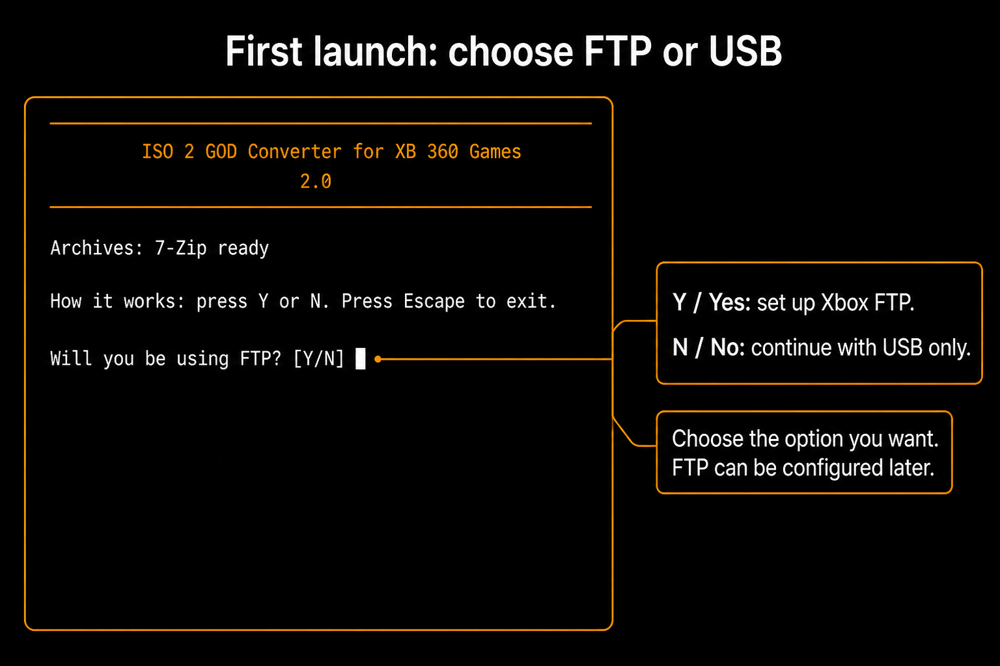
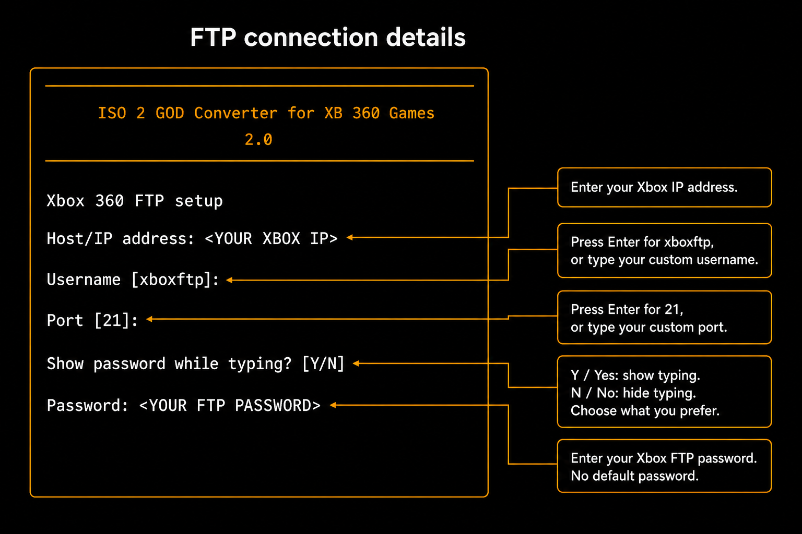
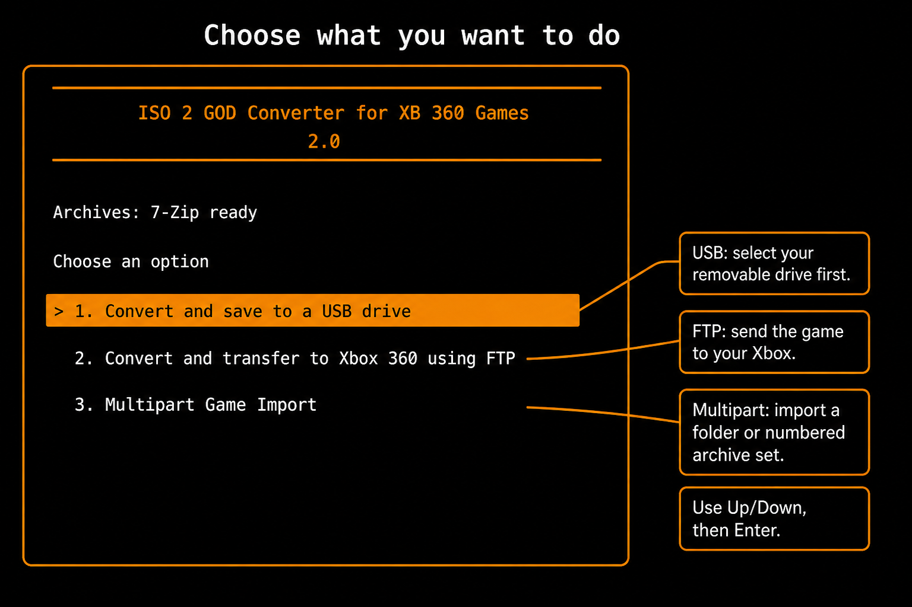
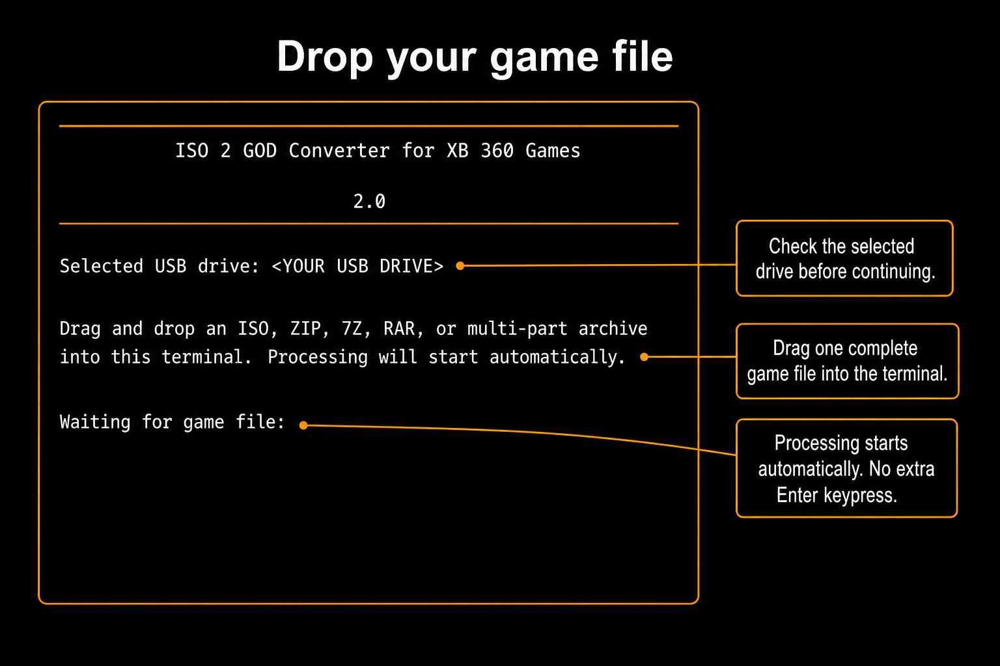
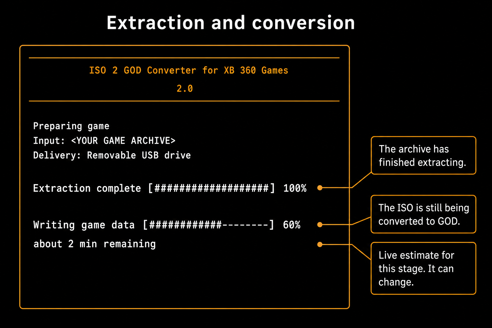
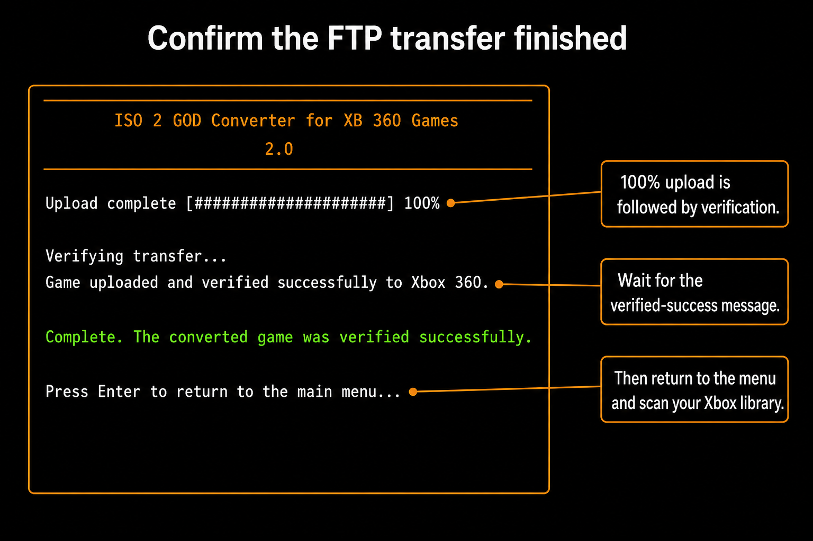
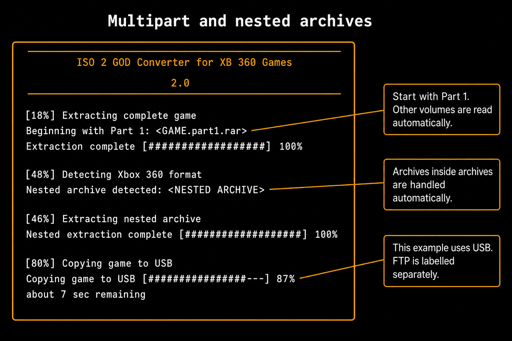

# ISO 2 GOD Converter 2.0

Prepare Xbox 360 game backups and send them to a USB drive or directly to your Xbox over FTP.
Supported original Xbox ISO images can also be converted to Xbox 360 Games on Demand (GOD) format;
playing them still requires compatible console software.

This is an optimized rewrite of [iso2god-cli](https://github.com/eliecharra/iso2god-cli), with a few
extra features.

## Downloads

Open this repository's **Releases** page and expand the release's **Assets** list. Download **one**
application matching your computer, rather than GitHub's automatically generated source-code
archives. The application downloads run directly; there is no application ZIP to extract.

| Your computer | Download |
| --- | --- |
| 64-bit Windows | `win-x64.exe` |
| 32-bit Windows | `win-x86.exe` |
| 64-bit Intel/AMD Linux | `linux-x64` |
| 32-bit Intel/AMD Linux | `linux-x86` |

Here, **x86 means 32-bit** and **x64 means 64-bit**. These releases do not include ARM builds.
macOS is currently unsupported: the maintainer does not own a Mac and cannot personally build and
test it. Community developers with Mac hardware are welcome to contribute and test a macOS version.

## User guide

Quick navigation: [FTP setup](#first-run--choose-whether-to-use-ftp) ·
[USB delivery](#1-save-a-game-to-usb) · [FTP delivery](#2-transfer-through-ftp) ·
[Multipart import](#3-import-multipart-archives) ·
[Find games on your Xbox](#find-the-game-on-your-xbox) ·
[Troubleshooting](#troubleshooting).

The walkthrough follows the app's order: **first-run FTP choice → connection details if Yes →
main menu → game preparation and delivery**. The annotated images are illustrative recreations;
placeholder paths and progress values are examples, not live screenshots or test results.

Have the following ready:

- Your game backup: an ISO, a supported archive, or every volume of a multipart archive.
- An Xbox configured to run the resulting game format. The converter does not modify the console
  or make an incompatible game playable.
- For USB: a mounted, writable USB drive already set up for your Xbox.
- For FTP: the Xbox's current IP address, FTP username and password, and its FTP-enabled dashboard.
- Free space on the computer **and** the destination. Extraction and conversion can need more space
  than the compressed download. The folder containing an archive must also be writable.

Use backups you are entitled to use. If you want to retain numbered archive parts, make a backup
first: the manual archive workflow removes recognised source volumes after preparing and verifying
the game. See [source-file handling](#what-happens-to-your-original-files) before importing them.

### First launch on Windows

1. Save the executable in a permanent folder of your choice.
2. Double-click it. The converter opens in a terminal window.
3. Complete the extractor and optional FTP prompts described below.
4. Wait for **Choose an option** before selecting a workflow.

Open the app, choose where to send the game, and drag the game into the terminal at its input prompt.

### First launch on Linux

Open a terminal in the downloaded application's directory and run:

```sh
chmod +x linux-x64
./linux-x64
```

For 32-bit Linux, replace `linux-x64` with `linux-x86` in both commands. Use a terminal/file-manager
combination that inserts a local path when you drag a file into the terminal.

### First run — choose whether to use FTP

On a fresh setup, the FTP question appears **before the main menu**, once any update or extractor
prompts have been completed. Choose Yes or No according to how you want to use the app.



*Figure 1 — Choose **Y / Yes** for FTP, or **N / No** for USB-only use. Neither choice is required
for everyone. If you choose No, skip the connection fields below and continue to the main menu.
FTP can still be configured later.*

Press **Y** or **N** to make your choice. Pressing Enter accepts the current default, which is No
at this first-run question. To choose Yes, press Y explicitly.

### If you choose Yes — enter your Xbox FTP details



*Figure 2 — Enter your own IP and password. Accept the username and port defaults with Enter, or
type your custom values. Choose Yes or No for password visibility. Placeholder words are
instructions in this illustration, not text to type.*

**First-time setup is required if you choose FTP.** Downloads do not include the developer's Xbox address,
password or saved login. Each user must supply their own Xbox's **IP address and FTP password**.
Only the **username (`xboxftp`)** and **port (`21`)** have defaults.

For a fresh installation:

1. Enter the IP address displayed by your Xbox dashboard and press Enter. There is no default IP.
2. At **Username [xboxftp]**, leave the input empty and press Enter to use `xboxftp`. If you changed
   the username on your Xbox, type that username instead and press Enter.
3. At **Port [21]**, leave the input empty and press Enter to use `21`. If you changed the FTP port
   on your Xbox, type that port instead and press Enter.
4. At **Show password while typing?**, press **Y** to show it or **N** to hide it, according to
   your preference. Then enter your Xbox's FTP password and press Enter. There is no supplied
   default password. The app tests the connection before saving the working details.

Leaving username or port empty accepts the value shown in brackets; it does not send an empty
username or an unspecified port. Custom values must match the Xbox's FTP server. Entering a new
value here does not change the console's own configuration.

| Setup field | What to enter |
| --- | --- |
| **Host/IP address** | Your Xbox's current local IP, for example `192.168.1.50`. Enter the address itself, not the text `IP:`. |
| **Username [xboxftp]** | Press Enter if the dashboard uses `xboxftp`; otherwise type its actual username. |
| **Port [21]** | Press Enter unless your dashboard uses a different FTP port. |
| **Keep the current password?** | If shown, keep it only if it is still correct; otherwise choose No to replace it. |
| **Show password while typing?** | Press Y for Yes to show your typing, or N for No to hide it. |
| **Password** | Enter the FTP password configured on your Xbox. |

The example IP is not a preconfigured console. There is no universal password. Your Xbox destination
path is chosen automatically, so setup does not ask you to type it.

After the connection test succeeds, continue to the main menu. If it fails, choose **Retry
connection** or **Edit FTP details**. Make sure the Xbox is awake and its dashboard's FTP server
is running on the same local network.

### If an extractor prompt appears

Archives need an available extractor; multipart and nested archives require 7-Zip. If it is
missing, follow the offered installation option or open the official download page, install it,
and reopen the converter. Installation may require operating-system permission. **Archives:
7-Zip ready** means the extractor was found, not that a game has been tested.

Linux saved-password support requires an unlocked Secret Service keyring and `secret-tool`,
commonly supplied by `libsecret-tools`.

## Understand the main menu



*Figure 3 — After first-run setup, choose the workflow you need with Up/Down and Enter. The
highlight marks the current selection; it is not a recommendation to use USB for every game.*

| Choose | When to use it | What happens first |
| --- | --- | --- |
| **1. Convert and save to a USB drive** | One ISO or archive that you want on USB. | Search for USB drives and select the destination. |
| **2. Convert and transfer to Xbox 360 using FTP** | One ISO or archive that you want on the Xbox's internal drive. | Use saved FTP details, or complete connection setup. |
| **3. Multipart Game Import** | A folder of numbered volumes, Part 1, or a supported archive; keep a prepared local copy as well. | Choose USB or FTP, then set up that destination. |
| **4. Update now** | Install a newer release you declined at startup. | Open the update prompt. This choice is shown only when an update was deferred. |

Use **Up/Down** to move the orange selection and **Enter** to choose it. **Escape** backs out of
selection screens. Enter is still used for menus and typed setup fields; it is **not required
after dropping a valid game path** at a file-drop prompt.

AI control is separate from this menu. There is no Optional submenu and no AI screen to leave open.

## 1. Save a game to USB

**Result:** the complete prepared game is written to the USB drive you select. The Xbox does not
need to be connected to your computer over the network.

### Step 1 — Connect and select the drive

1. Connect your Xbox-compatible USB drive to the computer and wait for it to mount.
2. Highlight **1. Convert and save to a USB drive** and press Enter.
3. The app displays **Searching for removable USB drives...**, followed by **Removable USB transfer**.
4. Read each listed drive's label, root/path and free space. Highlight the intended drive and press
   Enter. Do not choose a drive merely because it is first in the list.

If the list is empty, connect or mount the drive and choose **Refresh drive list**. The app lists
detected removable/USB storage, not every internal disk. It does not format a drive for you.

### Step 2 — Drop the game file

After selecting the drive, the app displays **Selected USB drive** and the file-drop instructions.



*Figure 4 — Check the selected USB drive, then drop the game when “Waiting for game file” appears.
There is no additional Enter keypress after a complete, valid path is dropped.*

1. Open the folder containing your game in your file manager.
2. Drag **one ISO, ZIP, RAR or 7Z file** into the waiting terminal.
3. Release the mouse button. Once the complete local path is recognised, preparation starts
   automatically; do not press Enter to start extraction.
4. For a split set, keep every part together and drop Part 1, or follow
   [Multipart Game Import](#3-import-multipart-archives) to drop its folder.

Do not drop a shortcut, a download-page link, or a file that is still downloading.

### Step 3 — Wait for preparation and the USB copy

An ISO is converted to GOD. An archive is extracted first, then its contents are identified.
An already-prepared GOD package or supported `default.xex` game is preserved rather than converted
again.



*Figure 5 — Extraction has finished, but ISO conversion is still running. The example estimate
applies to the current stage; the game has not yet finished copying to USB.*

Leave the drive connected until the final completion message. Archive imports also verify the USB
copy after writing it. Direct ISO-to-USB conversion checks the prepared package before copying but
does not perform that same separate destination-file verification afterward.
USB progress is labelled for **USB**, not FTP. See
[progress and completion](#read-progress-and-confirm-completion) for what each stage means.

### Step 4 — Eject only after success

Wait for the final **Complete** success message with no operation error. Safely eject the drive
through your operating system, connect it to the Xbox, and follow
[Find the game on your Xbox](#find-the-game-on-your-xbox).

Required destination folders are created automatically. **Archive-to-USB imports** refuse an
existing game directory. **Direct ISO-to-USB conversion can replace matching files** in that game's
directory. Back up an existing installation before reinstalling; do not erase the entire Content
folder. These behaviours differ in the current implementation.

## 2. Transfer through FTP

**Result:** the prepared game is uploaded to the Xbox's internal drive over your local network.
The bundled **rclone** transfer engine runs in the background; no separate FTP client window is needed.

### Step 1 — Prepare the Xbox

Turn on the Xbox and leave its FTP-enabled dashboard running. Connect the computer and Xbox to the
same local network. Read the IP address and FTP settings from the console's dashboard, and keep
the console awake for the entire transfer.

Having the console powered on is not enough if its FTP server is not running. Launching a game
may stop the dashboard's FTP server, so remain in the dashboard while transferring.

### Step 2 — Select FTP and check setup

Highlight **2. Convert and transfer to Xbox 360 using FTP** and press Enter.

- If you already completed FTP setup on first launch, the app uses that saved connection.
- If you chose No earlier, setup opens now. Follow
  [If you choose Yes — enter your Xbox FTP details](#if-you-choose-yes--enter-your-xbox-ftp-details).
- If your console uses custom credentials, enter those values instead of the displayed defaults.

You do not have to type the destination path; the app chooses it for the detected game format.

### Step 3 — Confirm the connection test

Wait for **Connection successful. FTP settings saved.**

If setup reports an error:

- Choose **Retry connection** after waking the Xbox or starting its FTP server.
- Choose **Edit FTP details** to correct the IP, username, password or port.
- Choose **Cancel FTP setup** to leave setup.

The `:21` in an address such as `192.168.1.50:21` identifies the FTP port; it is not an extra part
of the IP address. Do not remove the port merely because the dashboard displays only the IP.

### Step 4 — Drop the game and let the transfer finish

At **Waiting for game file**, drag in the ISO or supported archive as shown in Figure 4.
Preparation begins automatically. The app extracts and prepares the game, uploads it using FTP,
and then verifies the uploaded files.

Do not close the converter, switch off the Xbox, or launch a game while upload or verification is
running. If an error occurs, read it before retrying; it does not automatically mean the whole
upload has been lost.

### Step 5 — Check the verified-success message



*Figure 6 — Wait for “Game uploaded and verified successfully to Xbox 360.” Upload reaching 100%
is followed by verification; the verified-success message confirms that stage has finished.*

GOD packages go under `/Hdd1/Content/0000000000000000/`. Extracted `default.xex` games go under
`/Hdd1/Games/<Game Name>/`. Follow the [Xbox library steps](#find-the-game-on-your-xbox) after success.

FTP passwords use Windows Credential Manager or Linux Secret Service; the bridge does not return
them. FTP traffic itself is unencrypted, so use a trusted local network. FTP copy operations can
replace matching remote files: unlike the local/USB existing-directory check, an FTP transfer
should not be treated as a protected “never overwrite” operation.

### Step 6 — Add the scan path if the game does not appear

After a successful transfer, check your Xbox dashboard's game library. If it has not found the
game automatically, open its content/library scan-path settings and add the appropriate location:

| Game format | Internal drive — normal FTP destination | External drive — USB example |
| --- | --- | --- |
| GOD, including converted ISO games | `/Hdd1/Content/0000000000000000/` | `/Usb1/Content/0000000000000000/` |
| Extracted `default.xex` games | `/Hdd1/Games/` | `/Usb1/Games/` |

For an external drive, use **the same folder path beneath the drive root**, but select the actual
external device instead of Hdd1. This example uses **Usb1 for the games drive**, with Usb0 occupied
by the exploit USB. Device numbering can differ between consoles, so select the device shown by
your dashboard for the drive containing the games, not the exploit USB. Some dashboards display
these paths as `Hdd1:\Content\0000000000000000\` and `Usb1:\Content\0000000000000000\`;
they refer to the same locations shown above.

Save the path, set the scan depth high enough to reach the game files, and run a content scan.
Then return to the game library. Keep an external drive connected while scanning and playing.
Adding the internal-drive path will not find a game stored on an external drive, or vice versa.
You only need to add a scan path if the correct one is not already configured.

### Clean downloads and saved settings

All four downloads—Windows x64/x86 and Linux x64/x86—use this setup procedure. The executable does
not contain a preconfigured personal login. After a successful setup, connection settings are
stored in the current user's application settings and the password in the operating system's
credential store, not alongside or inside the release executable.

On the same operating-system account, the 32-bit and 64-bit builds share the converter's saved
settings. Renaming, replacing or downloading the executable again does not reset that account's
existing setup. On a new user's account, setup starts without a saved Xbox address or password.
USB-only users can decline FTP setup and configure it later when they first choose FTP.

## 3. Import multipart archives

**Result:** one complete game is prepared from its archive set, delivered through USB or FTP, and
a prepared local copy is retained beside the source. Use this option when you prefer to drop a
folder containing the parts rather than select a single file.

### Step 1 — Finish downloading every part

Keep the original filenames and place every part of **one game directly inside the same folder**:

```text
My Game/
├── My Game.part1.rar
├── My Game.part2.rar
├── My Game.part3.rar
└── My Game.part4.rar
```

Drop the folder that directly contains the archive parts, not a parent folder with several levels
of downloads inside it.

Do not rename volumes to hide gaps, combine unrelated downloads, or extract each part separately.
7-Zip must read the set beginning with its first volume.

> **Keep a backup if you want to retain the downloads.** The manual workflow permanently removes
> recognised numbered source parts after preparing and verifying the game, before delivery starts.
> Read [What happens to your original files](#what-happens-to-your-original-files) below.

### Step 2 — Choose the delivery method first

1. Select **3. Multipart Game Import** on the main menu.
2. Choose **1. Save to a removable USB drive** or **2. Transfer to Xbox 360 using FTP**.
3. For USB, highlight the detected drive and press Enter, as in option 1.
4. For FTP, complete setup if requested, as in option 2.

This is a choice of destination, not a request to move the archive parts onto the USB drive first.

### Step 3 — Drop the archive folder or file

Wait for **Waiting for archive or folder**. The instructions above it say:

> Drag and drop the folder, Part 1, or archive file.
>
> Processing will start automatically as soon as it is dropped.

Drag in the folder from Step 1, its Part 1 file, or a supported single archive. A direct ISO belongs
in option 1 or 2. A complete dropped path starts the import without an additional Enter keypress.

If the folder contains several recognised sets, the app asks which game to import. Use Up/Down and
Enter to choose one. The manual import does **not** automatically transfer every game in the folder;
selected multi-game batches are available through the background AI/developer interface.

### Step 4 — Let the app check and prepare the game

The importer checks numbered parts, checks storage, and opens the first volume with 7-Zip. It then
verifies the extracted output and identifies the game format. If an outer ZIP contains another
supported archive or numbered RAR set, it can extract that nested set automatically.



*Figure 7 — Read from top to bottom: first-volume extraction, optional nested extraction, then
delivery. This example uses USB; an FTP transfer is labelled separately. Only the destination
you selected is used.*

| Extracted content | What the app does |
| --- | --- |
| Supported Xbox ISO | Convert it to a GOD package, then verify the prepared structure. |
| Existing GOD package | Preserve its package and data files and required Content directory structure. |
| Extracted game containing `default.xex` | Preserve the complete game folder; do not convert it to GOD. |
| No supported game found | Stop with an error instead of treating arbitrary extracted files as a playable game. |

If a numbered gap is detected, the error names the missing part. Put that exact file alongside the
other volumes and retry. A continuous sequence alone cannot prove that an unknown final volume
was downloaded: 7-Zip must also successfully read the complete archive. Keep all supplied parts,
not just enough to remove a visible numbering gap.

### Step 5 — Confirm delivery and keep the prepared copy

Wait for the USB copy or FTP upload **and its verification** to finish. At **Complete**, option 3
prints **Game prepared and verified successfully at:** followed by the retained local path.
Note that path if you want the prepared copy later.

The game has already been sent to the destination selected in Step 2. You do not need to copy the
retained output again to finish this import.

### What happens to your original files

These rules apply to archive processing through **all three manual menu options**, not just option 3.

| Item | Current behaviour |
| --- | --- |
| Direct source ISO | Left in its original location. |
| Ordinary single ZIP/RAR/7Z source | Preserved. Temporary nested extraction files are not the original archive. |
| Recognised numbered source volumes | Permanently removed after successful extraction and prepared-game verification, **before USB/FTP delivery**. |
| Failure during extraction or preparation | Source volumes are retained if the verified-cleanup stage has not been reached. |
| Failure after source-volume cleanup | The prepared game remains locally; the deleted archive parts are not restored. Note the paths in the output before closing the app. |
| Successful option 1 or 2 | Temporary prepared output is cleaned up after delivery; the destination copy remains. |
| Successful option 3 | The prepared local game is retained as well as the destination copy. |

Deletion is not a move to the Recycle Bin. Do not assume an error during a later transfer means
numbered parts still exist. Background AI jobs have a different default: they preserve source
archives unless explicitly instructed otherwise.

## Read progress and confirm completion

There are two different kinds of progress display. Orange headings such as
**[18%] Extracting complete game** are workflow checkpoints. The changing progress bar underneath
describes the current operation. They are not competing measurements of the same thing.

| Stage | What is happening | What you should do |
| --- | --- | --- |
| Scanning / detecting parts | Identify the archive set in the dropped location. | Wait, or choose one set if prompted. |
| Checking missing parts / storage | Check numbering and space available for extraction. | Resolve any named missing file or space error before retrying. |
| Extracting complete or nested archive | Unpack the archive set using 7-Zip. | Keep all source files available. |
| Verifying / detecting format | Check the extracted content and recognise a supported game. | Wait; extraction success alone is not game verification. |
| Converting / writing game data | Create GOD output from an ISO, when necessary. | Leave the app running; existing GOD or extracted games skip unnecessary conversion. |
| Preparing destination / copying / uploading | Write to your selected USB drive or Xbox FTP destination. | Keep the drive connected or the Xbox dashboard's FTP server running. |
| Verifying transfer | Archive imports and FTP transfers check destination files against expected files and sizes. Direct ISO-to-USB does not perform this separate post-copy check. | Do not disconnect while verification is running, even if the copy bar reached 100%. |
| Complete | The workflow has reported success. | Eject USB safely or rescan your Xbox library. |

**Time remaining is an estimate for the current stage, not a promise for the entire job.** It appears
once the app has enough progress to estimate a rate, can rise or fall as the workload changes, and
starts over for the next stage. A short pause at a stage boundary is not automatically a failure.

Prepared-game verification checks supported structure. Archive delivery and FTP verification also
check expected destination files and sizes; direct ISO-to-USB has the limitation described above.
None of these checks is a byte-for-byte checksum comparison or an Xbox gameplay test. Successful transfer
does not guarantee that a damaged source or incompatible game will launch.

## Find the game on your Xbox

After the converter reports success, your dashboard may still need to scan the destination.
Copying a game and adding it to the dashboard's library are separate steps.

### Step 1 — Make the destination available

- **USB delivery:** safely eject the drive from the computer and connect it to the Xbox. Leave it
  connected while scanning and playing.
- **FTP delivery:** the files are already on the Xbox's internal drive; there is no USB step.

### Step 2 — Check the game files in the dashboard's file manager

Look on the drive you actually used, rather than relying on the game's cover appearing in the library.

| Format | Path relative to the USB drive root | FTP path on the internal drive |
| --- | --- | --- |
| GOD | `Content/0000000000000000/<TitleID>/00007000/` | `/Hdd1/Content/0000000000000000/<TitleID>/00007000/` |
| Extracted game | `Games/<Game Name>/default.xex` plus the rest of the game | `/Hdd1/Games/<Game Name>/default.xex` plus the rest of the game |

`<TitleID>` means the game's own title ID, not a folder literally named TitleID. The computer's
drive letter is not the Xbox's device name.

A GOD game's small package file and its matching `.data` folder belong together. Do not move only
the package file or rename the matching data folder. An extracted game also needs its accompanying
files, not just `default.xex`.

### Step 3 — Add the correct library scan location

In your dashboard's content/library settings:

1. Open the scan-path settings.
2. Add or check the exact scan location from
   [Add the scan path if the game does not appear](#step-6--add-the-scan-path-if-the-game-does-not-appear):
   `Content/0000000000000000/` for GOD games or `Games/` for extracted games, on the drive actually
   containing the files. Use Hdd1 for the normal internal FTP destination; use the external
   device's name for a game copied to USB.
3. Set the scan depth high enough to reach the game files below the nested folders.
4. Save the path and run the dashboard's content scan.
5. Return to the game library and launch the title.

Dashboard menu labels differ; these are the required steps, not a claim that every dashboard uses
the same button names. A title-update screen manages updates, not the installed game's main files.

If the game is missing, confirm the files exist on that device before repeatedly scanning. If a
cover appears but launching is unavailable, check whether its underlying game files are present.
A cached cover is not evidence that an installation is complete.

## Background AI and developer control

AI integration is built into the executable and runs separately from the terminal interface.
There is no Optional menu and no AI screen to leave open. A compatible AI client or developer tool
starts the executable with `--mcp-server` as a background process and communicates through its
standard input/output. The terminal application does not need to be running.

This is operational control, not just a diagnostic viewer: the connected client can prepare games,
run a selected batch, copy to local/USB storage, transfer through the saved FTP connection, verify
prepared games, configure/test FTP, install 7-Zip where supported, and check/install updates.

The app does not include an AI model. Use a client that supports local MCP tools; whether its model
is local or hosted is the client's choice. A chatbot without local tool access cannot directly
control your computer. Normal manual operation does not require any AI service.

### Connect a client

In the client's MCP server settings, use the full executable path as the command and
`--mcp-server` as the only argument. For clients using an `mcpServers` JSON configuration:

```json
{
  "mcpServers": {
    "iso2god": {
      "command": "C:/Tools/ISO2GOD/win-x64.exe",
      "args": ["--mcp-server"]
    }
  }
}
```

Replace the example path with your actual executable. On Linux, use an absolute path such as
`/home/you/ISO2GOD/linux-x64` and make it executable first. Use the x86 filename for a 32-bit build.
Configuration formats vary by client; the command and argument remain the same.

The client starts and manages this background connection. This is not an automatically installed
Windows service or Linux daemon, and it does not open a network port. It runs with the permissions
of the operating-system account that starts it.

### Ask an AI to perform a task

After adding the server, enable its tools in your AI client and ask it to check the converter's
status. A connected client should call `converter_status` and report the build and extractor
readiness. If it only gives written advice, check its MCP connection and tool permissions.

For example, you could ask:

> Inspect the games in my downloads folder. Show me the recognised games first, then prepare only
> the two I select and copy them to my selected USB drive. Preserve the source archives and report
> when each job has completed.

Give the client the actual source folder and exact destination. It can scan and inspect, ask you
to choose inputs, list USB drives, start the authorised job, and read progress until it succeeds
or fails. For FTP, ask it to test the saved connection before transferring the selected games.
A batch request does not mean it should upload every download without your selection.

For a problem report, ask it to inspect the affected input and explain the error before changing
anything. The bridge exposes the operations below; repairing source code requires the developer
client's own authorised editor/build tools.

### Available tools

| Tool | Purpose |
| --- | --- |
| `converter_status` | Report version, platform, extractor availability and saved FTP readiness without returning the password. |
| `list_usb_drives` | List detected USB roots, labels and free space so the intended destination can be selected explicitly. |
| `scan_game_folder` | Scan a supplied downloads folder recursively and return possible ISO/archive/Part 1 inputs. Scanning alone does not process them. |
| `inspect_game_input` | Inspect a supplied input and identify the archive entry point or folder contents. |
| `start_job` | Start a supported operation in a background worker and return its job ID immediately. |
| `job_status` | Report whether the job is running, completed or failed, with its structured result and recent progress output. |

### Background operations

Pass an `action` to `start_job`:

| Action | What it does and what it needs |
| --- | --- |
| `process_games` | Prepare one or several explicitly selected `sources`, then deliver them. Supports ISO files, archives, multipart sets and already-extracted GOD/`default.xex` folders. |
| `verify_game` | Check prepared GOD or `default.xex` folders supplied in `sources`. Does not run the game on an Xbox. |
| `configure_ftp` | Test and save `host`, `password`, and optional `username`/`port` (defaults: `xboxftp`/`21`). |
| `test_ftp` | Test the saved connection without uploading games. |
| `install_archive_tool` | Install 7-Zip using the supported platform installer, or report that it is already available. |
| `check_updates` | Check the configured GitHub release source without installing anything. |
| `install_update` | Install an available release; restart the app and its AI connection afterward. |

For `process_games`, choose `destination`:

- `local`: supply an existing absolute `destination_path`; the app writes the appropriate Content
  or Games structure underneath it.
- `usb`: supply the exact root returned by `list_usb_drives`. The worker checks that it is still
  a detected USB drive and does not silently substitute a different destination.
- `ftp`: use the saved connection and automatic Xbox paths; omit `destination_path`.

Example `start_job` arguments for two explicitly selected downloads:

```json
{
  "action": "process_games",
  "sources": [
    "C:/Backups/Game One.iso",
    "C:/Backups/Game Two/Game Two.part1.rar"
  ],
  "destination": "local",
  "destination_path": "D:/PreparedGames",
  "remove_archive_parts": false
}
```

Use absolute paths. For a folder containing several multipart sets, scan first and supply each
selected Part 1 as a separate source. Jobs process sources sequentially and stop on the first
failure, reporting earlier completed outputs. Existing local/USB game directories are not
overwritten. FTP follows the app's normal copy behaviour and can replace matching remote files.

A returned job ID means **started**, not **finished**. Call `job_status` with
`{"job_id":"<returned ID>"}` until the state becomes `completed` or `failed`. Its progress tail
includes stages and available time estimates. Job IDs are scoped to the current bridge process.
Logs and results are retained in the temporary `iso2god-job-...` directory returned when the job
starts. If the client disconnects, an already-started worker may continue; reconnecting does not
restore its in-memory job registry. Do not start a duplicate transfer without checking its saved
result and destination first.

Background jobs preserve source archives by default. Set `remove_archive_parts: true` only when
the user requests deletion; recognised numbered volumes are then deleted **after successful
delivery and verification**. Single-file source archives remain intact. Failed preparation or
delivery leaves recovery files at the location recorded in the job log.

Only user-authorized inputs, destinations and operations should be passed to the bridge. Passwords
are passed to the configuration worker through its input pipe, not saved in job request files or
returned in results. The AI client may retain its own tool-call history. Do not run simultaneous
manual and AI operations against the same game or destination. Background workers reject concurrent
automation jobs rather than interleave transfers.

An installer requiring interactive elevation cannot obtain that approval through the background
worker. Complete installation locally with the required permissions and retry.

### Developer use

The bridge uses newline-delimited JSON-RPC over stdio and advertises its tool schemas through
`tools/list`. Long operations run in child processes, keeping normal progress output out of the
MCP protocol stream. This lets an editor, test harness or AI client use the same app operations.

For scripts that only need discovery, `--ai-status` prints readiness as JSON and
`--scan-folder-json <folder>` prints a batch plan. `--help` documents the existing conversion CLI.
Developers can run the automated checks from the source repository:

Install Rust and Git LFS first. The bundled transfer-engine binaries in `vendor/rclone/` are
stored using Git LFS; after cloning, run `git lfs pull` before building. A GitHub source-code
archive may not include these binaries. Normal application downloads do not require Rust or Git LFS.

```sh
cargo test --release --locked --bin iso2god
cargo build --release --locked --bin iso2god
python tests/automation_smoke.py target/release/iso2god
```

On Windows, use `target/release/iso2god.exe` in the final command. Install 7-Zip to include archive
smoke tests. The smoke test uses synthetic files, not your games or Xbox. Set
`ISO2GOD_RCLONE_INTEGRATION=1` when running the Rust tests to include the local FTP-server test.

Application control does not grant an AI arbitrary shell access or a source-code editor. A developer
AI can modify and rebuild the project through its own authorized development tools; the bridge
exposes the implemented converter operations rather than an unrestricted command-execution endpoint.

## 4. Update now

Release builds use the existing `self_update` library to check their configured GitHub repository
for a newer release at startup. You do not need to install a separate updater.

1. Open the converter. If a newer version is found, **Update available** replaces the normal menu
   and shows the current and available versions.
2. Choose **Yes** to download and install the matching platform release, or **No** to continue
   using the current version.
3. If you choose No, **4. Update now** appears directly on the main menu for that session. Select
   it later when you are ready to update; it is not inside Optional or another submenu.
4. Wait for the installation-success message. Close and reopen the converter to use the new
   executable. Restart a connected AI client's converter bridge as well.

There is no permanent fourth item when no update is waiting. Checks happen at startup, not during
an active transfer. Do not start an update while another converter process is using the executable.
If installation fails, check the reported error, network access and write permission to the
application folder before retrying.

Builds without a configured release repository do not check automatically. Download the correct
newer executable from Releases manually after closing the app. Keep game files separate from the
application download.

## Troubleshooting

- **No USB drive detected:** connect and mount it, then choose **Refresh drive list**. The menu
  lists detected removable/USB storage, not every internal disk.
- **Dropped path does not start:** wait for the file-drop prompt and check that the file exists.
  Your terminal must insert a local path when you drop it. For multipart imports, drop the folder
  or Part 1 with all remaining volumes alongside it.
- **Missing part or extraction error:** finish downloading every volume and check filenames. Test
  the archive in 7-Zip if necessary before retrying.
- **Not a recognised game:** the contents must include a supported ISO, valid GOD package, or
  extracted game with `default.xex`; an archive extension alone is not enough.
- **FTP connection fails:** check the IP, credentials, port, network, and dashboard FTP server, then
  retry. The `:21` in connection messages is the FTP port, not extra digits in the IP address.
- **Destination already contains this game:** archive-to-USB delivery refuses an existing game
  directory. Direct ISO-to-USB and FTP can replace matching files. Back up the specific installation
  before reinstalling; do not delete unrelated titles, saves or the whole Content directory.
- **Time remaining changes:** estimates are calculated during processing and can rise or fall.
  Extraction, conversion, and copying are separate stages. Wait for the final success message;
  reaching 100% on a progress bar may still be followed by verification.
- **Transfer finished but game will not launch:** check the complete output structure, scan path,
  source game and console compatibility. See the verification limits above; completion is not a
  gameplay test. A cover can remain even when its underlying game files are missing.
- **Folder import finds no parts:** drop the folder directly containing the numbered volumes.
  Dropping an ordinary single ZIP/RAR/7Z file is supported, but scanning its parent folder is not
  the same as selecting that file.
- **Source archives disappeared:** recognised numbered volumes are removed after preparation in
  manual workflows. Look for the retained prepared game and read the source-file handling table
  before attempting a retry. An ordinary single source archive is preserved.

## Credits

This project preserves the work and attribution of every contributor in its original project
history.

| Contributor | Project contribution |
| --- | --- |
| [Elie Charra (`eliecharra`)](https://github.com/eliecharra) | Original author of [`iso2god-cli`](https://github.com/eliecharra/iso2god-cli) |
| [Ilia Pozdnyakov (`iliazeus`)](https://github.com/iliazeus) | Creator and primary developer of the optimized `iso2god-rs` rewrite |
| [BUD M4N (`rileyadams05`)](https://github.com/rileyadams05) | Developer and maintainer of this continuation |
| [`astarivi`](https://github.com/astarivi) | `iso2god-rs` contributor |
| [`TonyMacDonald1995`](https://github.com/TonyMacDonald1995) | `iso2god-rs` contributor |
| [`blank-query`](https://github.com/blank-query) | `iso2god-rs` contributor |
| [`cocciasecca`](https://github.com/cocciasecca) | `iso2god-rs` contributor |

Thank you to every contributor for the foundation on which this continuation is built.

## License

Distributed under the [MIT License](LICENSE). The original copyright and permission notice remain
intact. Notices for bundled third-party components are provided in
[THIRD-PARTY-NOTICES.txt](THIRD-PARTY-NOTICES.txt).
